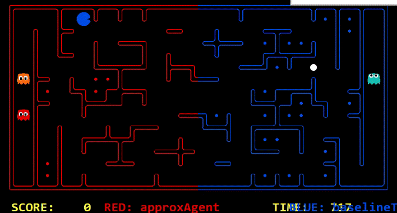
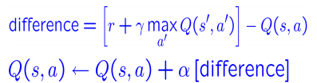
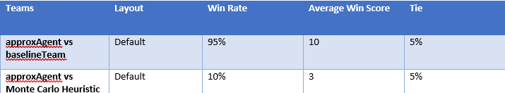

# Evolution of the approach

You can include screenshots of precompetition results and animated gifs, to showcase the evolution of your agents.

## My First Agent - Approach Foo
----

Lorem ipsum dolor sit amet, consectetur adipiscing elit, sed do eiusmod tempor incididunt ut labore et dolore magna aliqua. Ut enim ad minim veniam, quis nostrud exercitation ullamco laboris nisi ut aliquip ex ea commodo consequat. Duis aute irure dolor in reprehenderit in voluptate velit esse cillum dolore eu fugiat nulla pariatur. Excepteur sint occaecat cupidatat non proident, sunt in culpa qui officia deserunt mollit anim id est laborum.

### Demo

#### Competition results: Position - 4/5 | Percentile - 80%

#### Strategy summary

| Pros | Cons |
|-----------------|:-------------|
| First body part | Second cell  |
| Second line     | foo          |
----
## My Third Agent - Approximate Q-Learning Approach
----

### Classical Q-Learning Approach

Initially, we worked on the classical Q-learning approach, but the observations were based on the number of food left. Approximately after 30 episodes of training, the agent was only able to reach the opponent's map and was unable to collect food. Mostly, the agent moved perpendicularly and hence we decided to try a different approach with further observations.

### Demo - Classical Q-Learning Agent

### Approximate Learning Approach

We have implemented Approximate Q-Learning algorithm as an attacking agent. The observations taken per state are 
  * Score of successor state
  * Nearest food
  * Distance between the ghost and the pacman
  * Possible action per state
  * Distance to the safe zone if the enemy is near.

Each observation is stored in a list along with its weights. Later, the Q(state,action) is represented as g(feature1(state,action),feature1(state,action),...,featureN(state,action)). The weights are updated by adding the weights of the current state and the difference in weights of discounted successor state and current state.

The pacman will prefer the action with maximized weight value for each state.

### Working:

* At the start of the algorithm, the agent will check whether the policy is initialized or not, if it is not initialized then the algorithm will initialize the list with the pair features & weights, otherwise the algorithm will start choosing the action with higher rewards.

* Initially the Pacman will check whether there is any action with maximum rewards in the policy, if it is available, then the action with higher reward points will be chosen, otherwise the random action will be taken from the set of possible actions.

* After every action, the weights of the policy will be updated with the below formula.

### Strategies used:

* Calculating the distance based on the probability: We'd like to find the Probability of the ghost being at this distance given that we got this noisy distance, 
    * p(noisy | true) = p(true | noisy) * p(true) / p(noisy)
    * p(noisy) is 1 - we know that for certain.
    * So return p(true | noisy) * p(true)

* If the Pacman have collected some food pellets and if the enemy is chasing the Pacman and if the Pacman is near the safe zone, then the first priority for the Pacman would be going to the safe zone. (where safe zone is the play area of the Pacman)

* If the map have only 2 food pellets, then the Pacman will return to the safe zone as soon as possible.

## Demo - Approximate Q-Learning agent

### Not yet submitted for Competition

## Strategy summary

## Pros & Cons

| Pros | Cons |
|-----------------|:-------------|
| Much efficient algorithm if the training is done properly | Takes much time to complete the training process, around 10 - 15 episodes of training is needed for better results   |
| Once the pacman decides that a particular action lets it die, it will avoid such events.      | The Pacman doesn't know the entire environment and its purely dependent on the previous state and the successor state  |
| Since the enemy's distance is calculated based on the probability, the Pacman have higher chances of dodging the enemy. | Since the defense mechanism is not implemented, the probability of winning is less. |